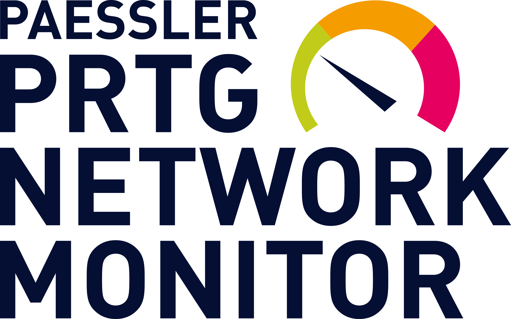

<!-- PROJECT SHIELDS -->
<!--
*** I'm using markdown "reference style" links for readability.
*** Reference links are enclosed in brackets [ ] instead of parentheses ( ).
*** See the bottom of this document for the declaration of the reference variables
*** for contributors-url, forks-url, etc. This is an optional, concise syntax you may use.
*** https://www.markdownguide.org/basic-syntax/#reference-style-links
-->
[![Contributors][contributors-shield]][contributors-url]
[![Forks][forks-shield]][forks-url]
[![Stargazers][stars-shield]][stars-url]
[![Issues][issues-shield]][issues-url]
[![Unlicense][license-shield]][https://unlicense.org/]
[![LinkedIn][linkedin-shield]][https://www.linkedin.com/in/mevanssecurity/]

 

  
  
  </a>

  <h3 align="center">Shell Scripts for Linux & PRTG</h3>

  

    A collection of bash shell scripts for pulling some of my hobby projects stats into the PRTG monitoring system
     
     
    <a href="https://github.com/othneildrew/Best-README-Template">The Scripts</a>
    ·
    <a href="https://github.com/x86txt/prtg/issues">Report Bug</a>
    ·
    <a href="https://github.com/x86txt/prtg/discussions">Laugh at my Code</a>
  

