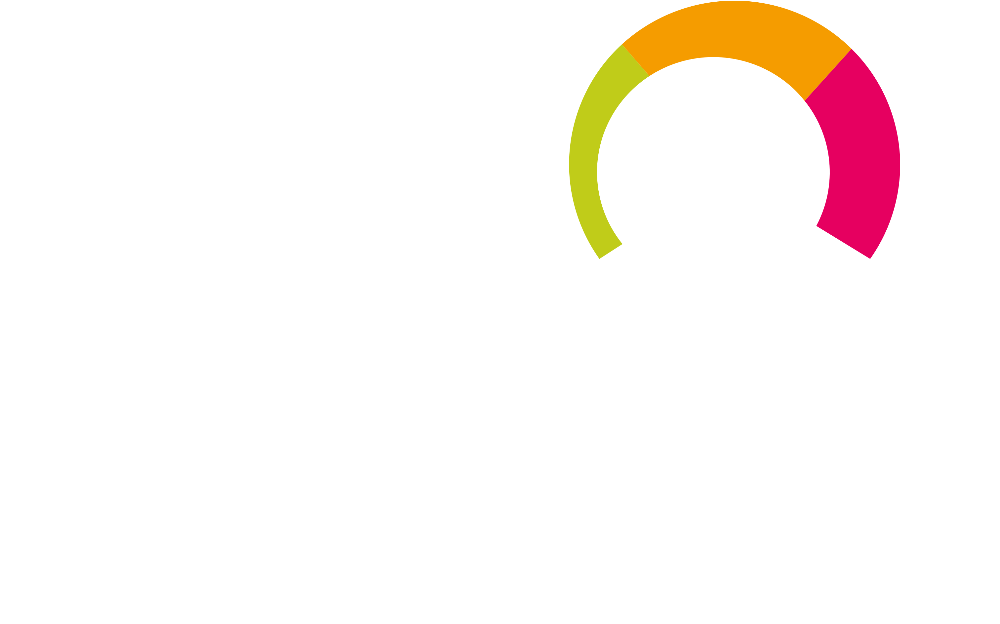

<!-- PROJECT SHIELDS -->
[![Contributors][contributors-shield]][contributors-url]
[![Forks][forks-shield]][forks-url]
[![Stargazers][stars-shield]][stars-url]
[![Issues][issues-shield]][issues-url]
[![MIT License][license-shield]][license-url]
[![LinkedIn][linkedin-shield]][linkedin-url]

<!-- PROJECT LOGO -->
 

  
    &nbsp;&nbsp;&nbsp;&nbsp;&nbsp;&nbsp;
  
  </a>

  <h3 align="center">Shell Scripts for Linux & PRTG</h3>

  

    A collection of bash shell scripts for pulling some of my hobby projects stats into the PRTG monitoring system
     
     
    <a href="#the-scripts">Scripts</a>
    ·
    <a href="https://github.com/x86txt/prtg/issues">Report Bug</a>
    ·
    <a href="https://github.com/x86txt/prtg/discussions">Laugh at my Code</a>
  

| Scripts       | Purpose                                                       |
|---------------|---------------------------------------------------------------|
| <a href="https://github.com/x86txt/prtg/blob/main/scripts/blockchain.sh">blockchain.sh</a> | grab total percentage of monero blockchain present on server  |
| <a href="https://github.com/x86txt/prtg/blob/main/scripts/height.sh">height.sh</a>     | display the monero blockchain height, according to the server | 
| <a href="https://github.com/x86txt/prtg/blob/main/scripts/p2p.sh">p2p.sh</a>        | show how many peer-to-peer connections are active             |
| <a href="https://github.com/x86txt/prtg/blob/main/scripts/rpc.sh">rpc.sh</a>        | display the number of active wallet connections to the server |
| <a href="https://github.com/x86txt/prtg/blob/main/scripts/torOB.sh">torOB.sh</a>      | number of active connections to tor obfs4 proxy               |
| <a href="https://github.com/x86txt/prtg/blob/main/scripts/torOR.sh">torOR.sh</a>      | number of current connections to tor bridge OR port           |

(<a href="#readme-top">back to top</a>)

<!-- MARKDOWN LINKS & IMAGES -->
<!-- https://www.markdownguide.org/basic-syntax/#reference-style-links -->
[contributors-shield]: https://shields.secunit.io/github/contributors/x86txt/prtg.svg?style=for-the-badge
[contributors-url]: https://github.com/x86txt/prtg/graphs/contributors
[forks-shield]: https://shields.secunit.io/github/forks/x86txt/prtg.svg?style=for-the-badge
[forks-url]: https://github.com/x86txt/prtg/network/members
[stars-shield]: https://shields.secunit.io/github/stars/x86txt/prtg.svg?style=for-the-badge
[stars-url]: https://github.com/github_username/repo_name/stargazers
[issues-shield]: https://shields.secunit.io/github/issues/x86txt/prtg.svg?style=for-the-badge
[issues-url]: https://github.com/x86txt/prtg/issues
[license-shield]: https://shields.secunit.io/github/license/x86txt/prtg.svg?style=for-the-badge
[license-url]: https://github.com/x86txt/prtg/blob/main/LICENSE
[linkedin-shield]: https://shields.secunit.io/badge/-LinkedIn-black.svg?style=for-the-badge&logo=linkedin&colorB=555
[linkedin-url]: https://www.linkedin.com/in/mevanssecurity/
[product-screenshot]: images/screenshot.png

